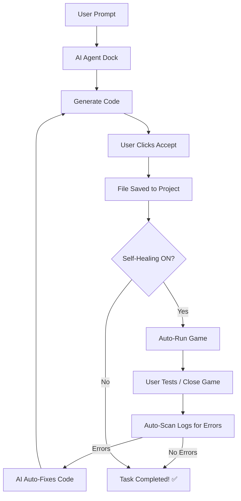

# 🤖 Hiru — Your Professional Godot AI Assistant

An advanced AI sidebar plugin for **Godot 4.x** (named **Hiru**) that gives you full control over your project through natural conversation. Built with a premium, modern aesthetic inspired by **Cursor**, **Antigravity**, and **VS Code Copilot**.

Powered by **moonshotai/kimi-k2-instruct** (or your choice of **Llama 3.1**, **Nemotron**, etc.) via **NVIDIA API**.

> **🚀 No Middleman:** No Python, no external servers, and no complex setup. Everything runs natively inside Godot using GDScript.

---

## ✨ Features that WOW

| Feature                     | Description                                                                              |
| :-------------------------- | :--------------------------------------------------------------------------------------- |
| 💎 **Premium UI**           | A sleek, dark, glassmorphic interface that feels like a professional dev tool.           |
| 🛠️ **Collapsible Toolbox**  | Keep your workspace clean. Toggle action buttons only when you need them.                |
| 🤖 **Model Selector**       | Swap models on the fly (Kimi, Llama 3.1 405B, Mistral, etc.) via the Settings menu.      |
| 🔄 **Self-Healing Loop**    | AI automatically runs your game after edits, monitors logs, and fixes bugs autonomously! |
| 🛡️ **Unified Diff Preview** | Review every line of code change in a beautiful side-by-side view.                       |
| ▶️ **Integrated Debugging** | Run Main Scene, Current Scene, or Stop directly from the sidebar.                        |
| ⚡ **Lightning Fast Save**  | Optimized project scanning for near-instant file operations.                             |

---

## 🛠️ Modern Architecture (Native 6-File Design)

The entire agent is contained within just 6 specialized GDScript files, making it lightweight and easy to maintain:

```text
addons/godot_ai_agent/
├── plugin.cfg               ← Manifest & Metadata
├── plugin.gd                ← Entry point & Editor integration
├── dock.gd                  ← Brain (UI, Logic, Diff Viewer, Self-Healing)
├── kimi_client.gd           ← NVIDIA API Connector
├── project_scanner.gd       ← File tree & Context builder
└── ghost_autocomplete.gd    ← AI-powered "Ghost" code completion
```

---

## 🚀 Getting Started in 60 Seconds

1.  **Installation**: Copy `addons/godot_ai_agent/` into your project's `addons/` directory.
2.  **Activation**: Enable **Godot AI Agent** in **Project Settings → Plugins**.
3.  **Authentication**: Click the **⚙️** icon in the header, paste your **NVIDIA API Key**.
    > 💡 Get your free key at [build.nvidia.com](https://build.nvidia.com)

---

## 🔧 Workflow: Self-Healing Loop



---

## 📄 License

**MIT** — Free to use, modify, and distribute. Build something amazing!
