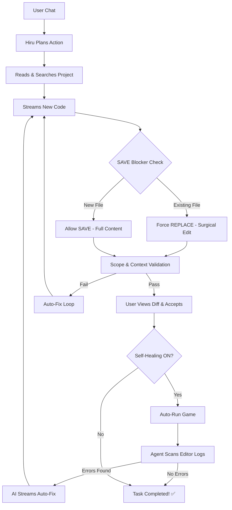

# 🤖 HiruAI — Godot AI Agent v3.0

An advanced, elite-level AI programming agent for **Godot 4.x**. Built with a premium aesthetic and capabilities inspired by **Cursor**, **Copilot**, and **Windsurf**. Hiru doesn't just autocomplete code; it reads your project files, plans its actions, and modifies your game directly—all while you watch.

Powered by **GLM 4.7**, **Claude 4.6 Sonnet**, **GPT-4o**, **Gemini**, and more via **NVIDIA NIM**, **Puter.com**, and **Google AI Studio**.

> **🚀 No Middleman:** No Python, no external servers, and no complex setup. Everything runs natively inside Godot using GDScript via direct Server-Sent Events (SSE).

---

## ✨ Agent Capabilities

| Feature                     | Description                                                                                      |
| :-------------------------- | :----------------------------------------------------------------------------------------------- |
| ⚡ **Real-Time Streaming**  | Watch the AI type its responses token-by-token instantly. No more waiting!                       |
| 🧠 **Reasoning & Thinking** | Support for **GLM 4.7**, **Claude 4.6 Sonnet**, **GPT-4o**, and more via **NVIDIA NIM** and **Puter.com**. |
| 📡 **Live Activity Feed**   | Similar to Cursor, see a live feed of what the AI is currently doing _(Reading... Scanning...)_. |
| 🔄 **Self-Healing Loop**    | AI automatically runs your game after edits, monitors logs, and fixes bugs autonomously!         |
| ⚖️ **Dual API Keys**        | Support for **NVIDIA NIM**, **Puter.com**, and **Google AI Studio** with separate, independent API keys. |
| 🛠️ **Unified Diff Preview** | Review every line of code change in a beautiful side-by-side view before accepting.              |
| 🏷️ **XML & Bracket Tags**   | Highly flexible protocol detection supporting both `[BRACKET]` and `<XML>` style commands.       |

---

## 🛡️ v3.0 — Scope-Locked Architecture (NEW)

HiruAI v3.0 introduces a **multi-layered defense system** that prevents the AI from destroying your code when editing large files:

| Defense Layer               | What It Does                                                                                     |
| :-------------------------- | :----------------------------------------------------------------------------------------------- |
| 🔒 **Scope Lock Prompt**    | System prompt enforces surgical edits — AI must change ONLY the lines you asked for.             |
| 🛑 **SAVE Blocker**         | Hard blocks `[SAVE:]` on existing files. Forces AI to use `[REPLACE:]` (surgical line edit).     |
| 📏 **Scope Validator**      | Detects scope creep — warns if AI replaces 10 lines but sends 80 new lines.                     |
| 📐 **Context Validator**    | Checks indentation alignment at REPLACE boundaries to catch misaligned code.                     |
| 🧠 **Forced Planning**      | AI must read files and plan with `[THOUGHT:]` before any code changes.                           |

### Why?

Previously, when a file had 200+ lines and the AI needed to fix 5 lines, it would sometimes rewrite the **entire file** from memory — missing functions, breaking signals, and destroying working code. The v3.0 defense system makes this **impossible**.

---

## 🛠️ Lightweight Native Architecture

The entire agent is contained within an incredibly clean GDScript architecture:

```text
addons/hiruai/
├── plugin.gd                ← Entry point & Editor integration
├── dock.gd                  ← Agent UI, Streaming Logic, System Prompts
├── kimi_client.gd           ← Multi-Provider API Connector (NVIDIA, Puter, Google)
├── project_scanner.gd       ← File system abstraction & context builder
├── ghost_autocomplete.gd    ← AI-powered "Ghost" text completion
├── hiru_protocol.gd         ← Dual-syntax command parser (XML/Brackets)
├── hiru_validator.gd        ← Syntax, Scope & Context validation
├── hiru_diff.gd             ← Unified diff calculation (LCS-based)
├── hiru_utils.gd            ← UI Styles, RichText formatting & cleaning
├── hiru_const.gd            ← Theme constants & configuration
└── skills/                  ← Modular AI skill modules
    ├── architecture_patterns.gd
    ├── godot_expert.gd
    ├── optimization.gd
    ├── project_manager.gd
    ├── reasoning.gd
    └── ui_design.gd
```

---

## 🚀 Getting Started in 60 Seconds

1.  **Installation**: Copy `addons/hiruai/` into your project's `addons/` directory.
2.  **Activation**: Enable **HiruAI** in **Project Settings → Plugins**.
3.  **Authentication**: Click the **⚙️** icon in the header, paste your API keys:
    *   **NVIDIA NIM**: [build.nvidia.com](https://build.nvidia.com)
    *   **Puter.com**: [puter.com](https://puter.com)
    *   **Google AI Studio**: [aistudio.google.com](https://aistudio.google.com)

---

## 🔧 Workflow: Autonomous Loop



---

## 📄 License

This software is released under the **MIT License**. Free to use, modify, and distribute. Build something amazing!
