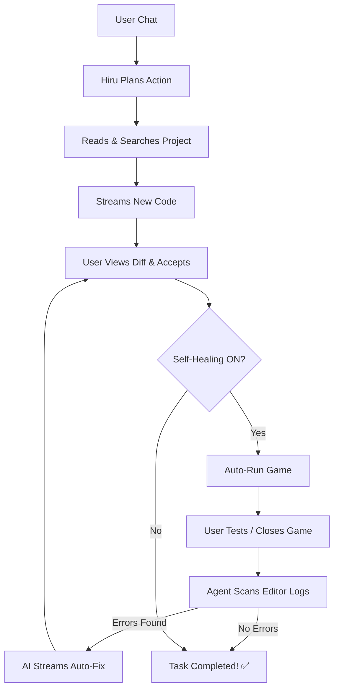

# 🤖 HiruAI — Premium Godot AI Architect

An advanced, elite-level AI programming agent for **Godot 4.x**. Built with a premium aesthetic and capabilities inspired by **Cursor**, **Copilot**, and **Windsurf**. Hiru doesn't just autocomplete code; it reads your project files, plans its actions, and modifies your game directly—all while you watch.

Powered by **GLM 4.7**, **Claude 4.6 Sonnet**, **GPT-4o**, and more via **NVIDIA NIM** and **Puter.com**.

> **🚀 No Middleman:** No Python, no external servers, and no complex setup. Everything runs natively inside Godot using GDScript via direct Server-Sent Events (SSE).

---

## ✨ Pro-Agent Capabilities

| Feature                     | Description                                                                                      |
| :-------------------------- | :----------------------------------------------------------------------------------------------- |
| ⚡ **Real-Time Streaming**  | Watch the AI type its responses token-by-token instantly. No more waiting!                       |
| 🧠 **Reasoning & Thinking** | Support for **GLM 4.7**, **Claude 4.6 Sonnet**, **GPT-4o**, and more via **NVIDIA NIM** and **Puter.com**. |
| 📡 **Live Activity Feed**   | Similar to Cursor, see a live feed of what the AI is currently doing _(Reading... Scanning...)_. |
| 🔄 **Self-Healing Loop**    | AI automatically runs your game after edits, monitors logs, and fixes bugs autonomously!         |
| ⚖️ **Dual API Keys**        | Support for **NVIDIA NIM** and **Puter.com** with separate, independent API keys.                |
| 🛠️ **Unified Diff Preview** | Review every line of code change in a beautiful side-by-side view before accepting.              |
| 🏷️ **XML & Bracket Tags**   | Highly flexible protocol detection supporting both `[BRACKET]` and `<XML>` style commands.        |

---

## 🛠️ Lightweight Native Architecture

The entire agent is contained within an incredibly clean GDScript architecture:

```text
addons/hiruai/
├── plugin.gd                ← Entry point & Editor integration
├── dock.gd                  ← Agent UI, Streaming Logic, System Prompts
├── kimi_client.gd           ← Multi-Provider API Connector (NVIDIA & Puter)
├── project_scanner.gd       ← File system abstraction & context builder
├── ghost_autocomplete.gd    ← AI-powered "Ghost" text completion
├── hiru_protocol.gd         ← Dual-syntax command parser (XML/Brackets)
└── hiru_utils.gd            ← UI Styles, RichText formatting & cleaning
```

---

## 🚀 Getting Started in 60 Seconds

1.  **Installation**: Copy `addons/hiruai/` into your project's `addons/` directory.
2.  **Activation**: Enable **HiruAI** in **Project Settings → Plugins**.
3.  **Authentication**: Click the **⚙️** icon in the header, paste your **NVIDIA** or **Puter** keys.
    *   **NVIDIA NIM**: [build.nvidia.com](https://build.nvidia.com)
    *   **Puter.com**: [puter.com](https://puter.com)

---

## 🔧 Workflow: Autonomous Loop



---

## 📄 License

This software is released under the **MIT License**. Free to use, modify, and distribute. Build something amazing!
